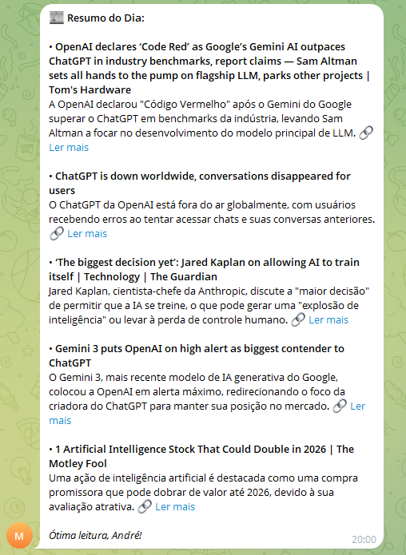

# Daily Newsletter Generator Agent

This project is an automated newsletter generator built with an n8n workflow. It allows users to receive daily news digests based on the 5 most recent and relevant articles in a specific topic domain using Brave Search. The process is integrated seamlessly with Telegram for easy delivery.

## Features
- **Automated Scheduling**: The flow is triggered every day at 8:00 PM (user-configurable timing).
- **Customizable Search**: Retrieves the top 5 relevant and fresh news items for keywords, with a specific topic focus.
- **AI-Driven Summaries**: News digests are dynamically generated using AI to ensure precision, brevity, and clarity.
- **Telegram Integration**: Newsletters are delivered directly via Telegram in a skimmable HTML-friendly format.
- **Duplicate Filtering**: Prioritizes novelty by comparing against history using a database (PostgreSQL) of previous newsletters.

## Workflow Overview
### Trigger
- Executes the entire workflow at 20:00 daily.

### Search Step
- Uses Brave Search API to obtain the top 5 relevant news items for a specified topic (e.g., "Artificial Intelligence").

### AI Summarization
- Filters duplicative headlines against history and uses a LangChain-powered agent (through `meta-llama 3.3 70b model`).
- Generates concise Telegram-friendly summaries like:
  `"• <b>[Title]</b> 
 🔗 <a href='URL'>Ler Mais</a>".`

### Delivery
- Using Telegram Bot API to push messages using strict HTML (`<b>`, `<i>`, `<a>` tags).

## Technical Highlights
- **Memory Persistence**: Newsletter history saved in a PostgreSQL DB ensures continuous avoidance of repeated reports.
- Langchain uses GPT integration trained subtask ToCustom Goals.
